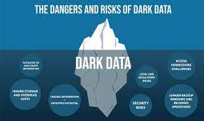

# Data storage architectures

- Data Warehouse
- Data Lake
- Data Lakehouse

## Databases

- collections of tables
- data comes from multiple sources
- goal: to analyse containing data
    - **Can we do it directly in the database?**

### OLTP vs. OLAP

[Reference](https://diffzi.com/oltp-vs-olap/)

#### Row-oriented vs. columnar storage

#### ACID properties

[Reference](https://www.bmc.com/blogs/acid-atomic-consistent-isolated-durable/)

#### Imagine this company-wise

- Many departments collect or buy the data
- Management would like to get insights from these data as a whole
- But:
    - The data might be (or, probably is) messy
    - Different bits of information can be found in different tables
- Does every department manage the collection, cleaning and maintenance by themselves?

## Data warehouse

Data warehouse characteristics:

- **Subject-oriented**: 
    - compiles subject-related data (e.g. sales, marketing, dstribution...)
    - prepares data for decision-making
    - excludes irrelevant data 
- **Integrated**:
    - integrates data from different sources
    - imposes rules to make data consistent (naming conventions, unifying date formats...)
- **Time-variant**:
    - each record contains a notion of date 
    - long-term data collection
    - when data is inserted into warehouse, it cannot be changed
- **Non-volatile**:
    - data is read-only

[Reference](https://www.guru99.com/data-warehouse-architecture.html)

### ETL (Extract-Transform-Load) Process

- **Extract** the data from its source
- **Transform** it into a pre-defined form
    - Remove corrupted data (schema-on-write)
    - Consolidate the date format, gender notation…
- **Load** into the data warehouse

- Benefits:
    - The data is clean and ready to use
- Issues:
    - Proprietary solutions (expensive, data lock-in)
    - Lots of work
    - What if the data is never exploited?
    - What if the data is not structured?

## Data Lake

- Store the data as it comes
- Prepare it only if / when needed 
    - ELT (extract-load-transform)

### Two-tier architecture

Data Lake + Data Warehouse:
- Data lake brings:
    - big storage (cloud, HDFS) with data resiliency
    - store all types of data
- Data warehouse brings:
    - ETL for selected data

### Governance

### Pros and Cons

Pros:

- many different types of data
- data doesnʼt need to be structured
- lesser workload for transformations: ELT instead of ETL

Cons:

- how to find anything back?!?
    - cataloging
    - lake-to-swamp
- staleness of data due to “the zones”
- “data over-acquisition”
    - do we really need all of it? => dark data

## Data Lakehouse

“Data Lake behaving like a database”:

- software layer on the top of the data lake
- management on the level of files
    - logs
    - metadata
- ACID transactions

Different solutions available (all open-source):

- Delta Lake (https://delta.io/)
- Apache Hudi (https://hudi.apache.org/)
- Apache Iceberg (https://iceberg.apache.org/)

### Delta Lake

[Reference](https://databricks.com/fr/wp-content/uploads/2020/12/cidr_lakehouse.pdf)

Building blocks:

- Delta **tables** - contain the data, enable time-traveling
 -Delta **transaction logs** - it stores every executed transaction -> single source of truth for delta table changes
- Delta **engine** - performance optimization for SQL and DataFrames

Some of the features available in Delta Lake, but not in traditional Data Lake:

- time travel
- upsert, delete, merge operations
- support for streaming data
- data layout optimization (Z-order) 

### Architecture

### Delta Logs

[Reference](https://www.databricks.com/wp-content/uploads/2020/08/p975-armbrust.pdf)

### Time Traveling (= table versioning)

[Reference](https://www.databricks.com/wp-content/uploads/2020/08/p975-armbrust.pdf)

## Data lakes vs. Data lakehouses vs. Data warehouses

[Reference](https://databricks.com/fr/discover/data-lakes/introduction)

